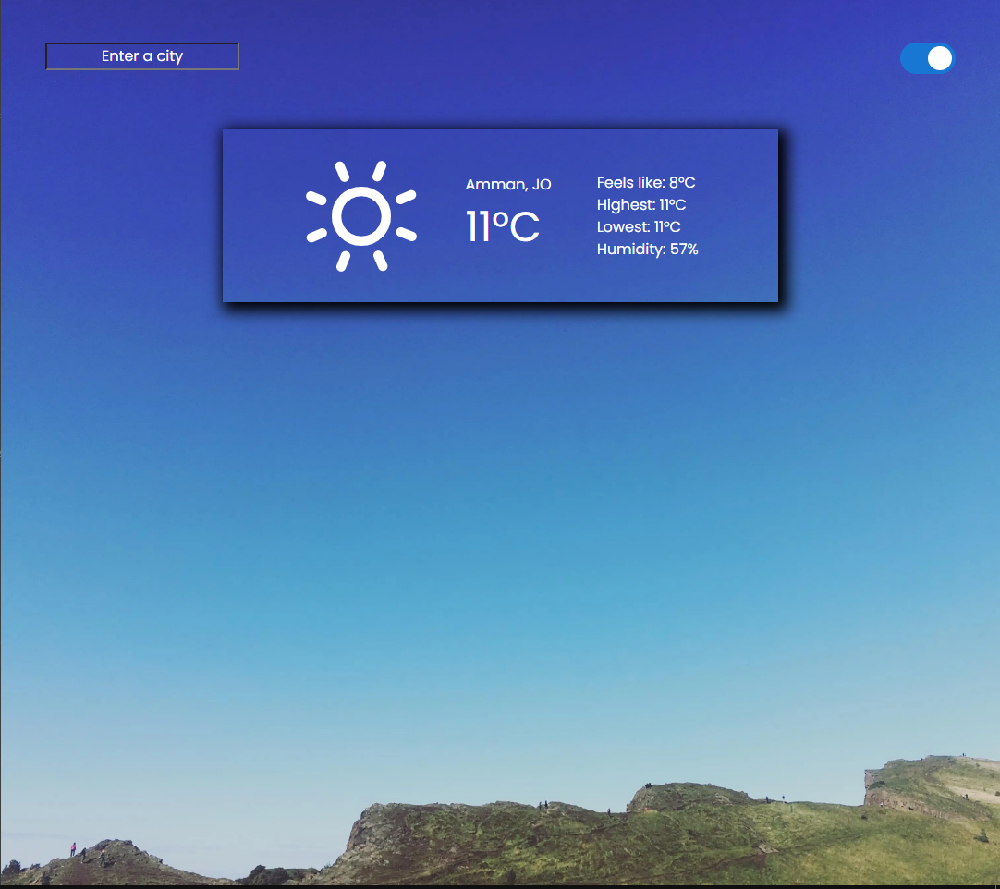

# Weather App

> The main objective for this application is to practice the concepts of async and await using APIs. In this project, I built a Weather App using the Open Weather API to get and display data on different cities.

## Built With

- HTML
- JavaScript
- Webpack
- Open Weather Api

## Live Demo

[Live Demo](https://sanadwj.github.io/Weather-app/)

## Features:
- The user can search for the weather reports of various cities
- The background image will change depending on the weather in the cities
- The user can toggle between Celsius or Fahrenheit

### Getting Started
> Open Terminal

> Run : 
`
git clone git@github.com:sanadwj/Weather-app.git
`

> Run `npm install` 

> Run `npm run start` 

> Got to `https://openweathermap.org/` and signup, After signing up an email with api key will be sent to you email address.

> Copy the number and replace it with the Key in index.js

> Voila the app now working with your Api key

### Deployment

This project has been deployed on Github.

## Author

👤 **Sanad Abujbara**

- Github: [@sanadwj](https://github.com/sanadwj)
- Twitter: [@sandooog](https://twitter.com/sandooog)
- Linkedin: [sanad-abujbara](https://linkedin.com/in/sanad-abujbara)
- Portifolio: [sanadabujbara.tech](https://sanadabujbara.tech)

## 🤝 Contributing

Contributions, issues and feature requests are welcome!

## Show your support

Give a ⭐️ if you like this project!

## Acknowledgments

- Microverse
- GitHub
- JavaScript
